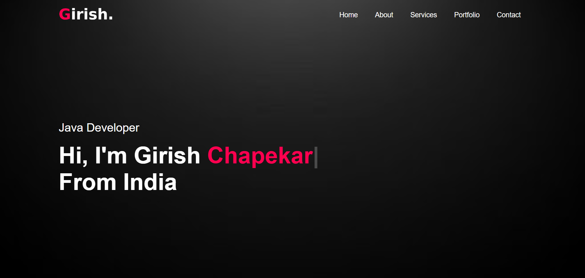
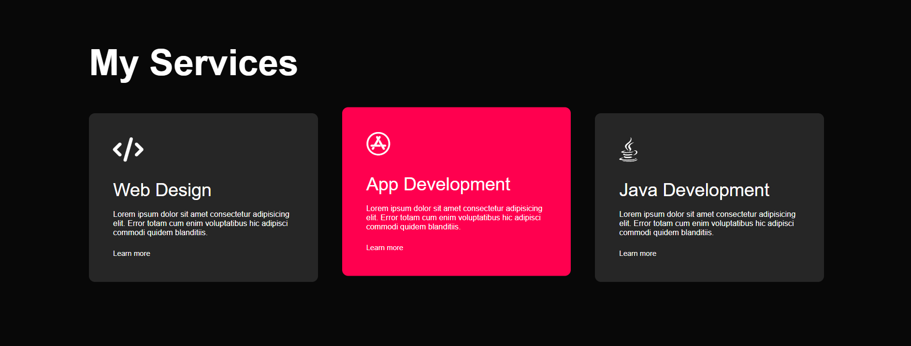
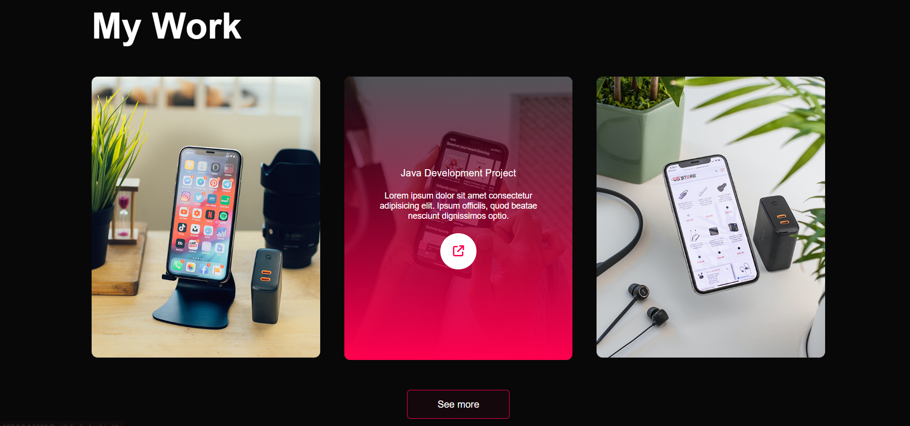

# My Portfolio Website

This is my personal portfolio website built using [Tech Stack - e.g., React, Tailwind CSS]. It showcases my projects, skills, and ways to contact me.

## 🔗 Live Site
[Visit the website](https://yourwebsiteurl.com)

## 🛠️ Tech Stack
- HTML
- CSS
- JavaScript

## 📂 Features
- Responsive design
- Project showcase
- Contact form
- Resume/CV section

📧 Contact
You can reach me at girishchapekar@gmail.com
 
## 📸 Portfolio Website Preview

Here are a few full-width screenshots of my personal portfolio website:

 

 

 

---

## 🎥 Portfolio Demo Video

> ⚠️ **Note**: GitHub does not support inline video playback from local files in `README.md`. But you can link to it like this:

[

